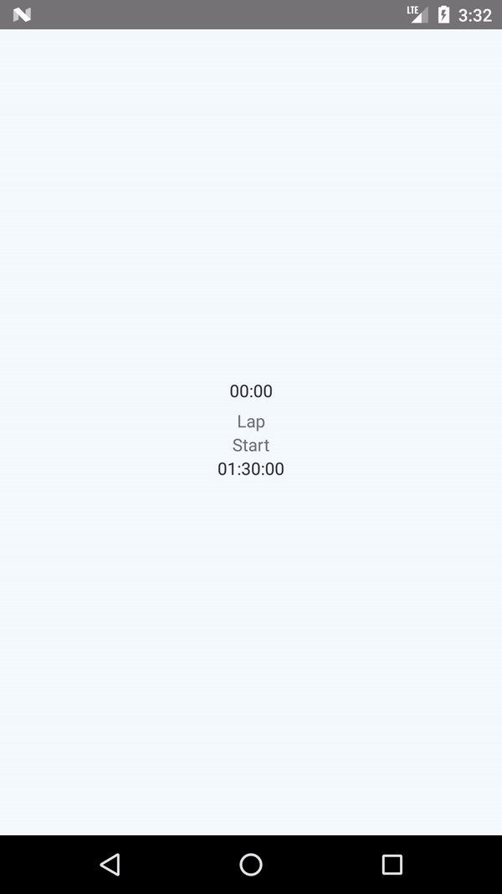

# React Native Samples

I added all my learning react-native sample code in one single repository

What you will find in this repository?

### 1 Login Screen
In this screen there is two edit text and input text validation.

### 2 React Native to Native app intigration
In react-native there is limitation to use native features of Android. So in this repository, I added sample code that runs in Android and it communicates message with React-Native application.

### 3 Timer
In this application, timer is created using react-native.

## Questions

Tweet me at: 

Don't forget to :star: this repository if it helps to learn!!
