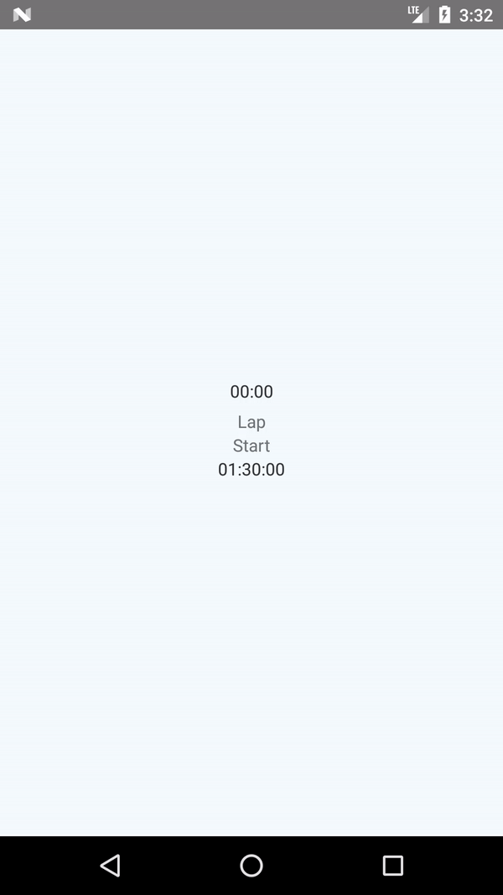

# React native timer

Timer in react native. To run it you must need [Node.js](https://nodejs.org/en/) installed in your system. After installing and setting up environment variables you need to, run on CMD, go to app's directory and run:

`npm install` this will install node modules in the directory. 

To run app in android run:
`react-native run-android`

## Screenshot

## How to contribute?
- Check out contribution :point_right: [Guidelines](./CONTRIBUTING.md)  

## Questions

Tweet me at: 

## Licence
    Copyright 2018 Krunal Kapadiya

    Licensed under the Apache License, Version 2.0 (the "License");
    you may not use this file except in compliance with the License.
    You may obtain a copy of the License at

       http://www.apache.org/licenses/LICENSE-2.0

    Unless required by applicable law or agreed to in writing, software
    distributed under the License is distributed on an "AS IS" BASIS,
    WITHOUT WARRANTIES OR CONDITIONS OF ANY KIND, either express or implied.
    See the License for the specific language governing permissions and
    limitations under the License.
